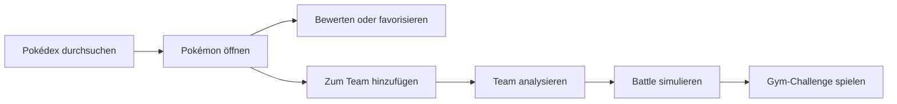
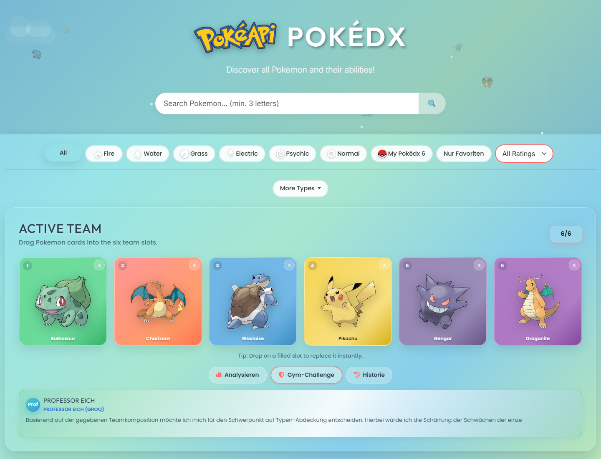
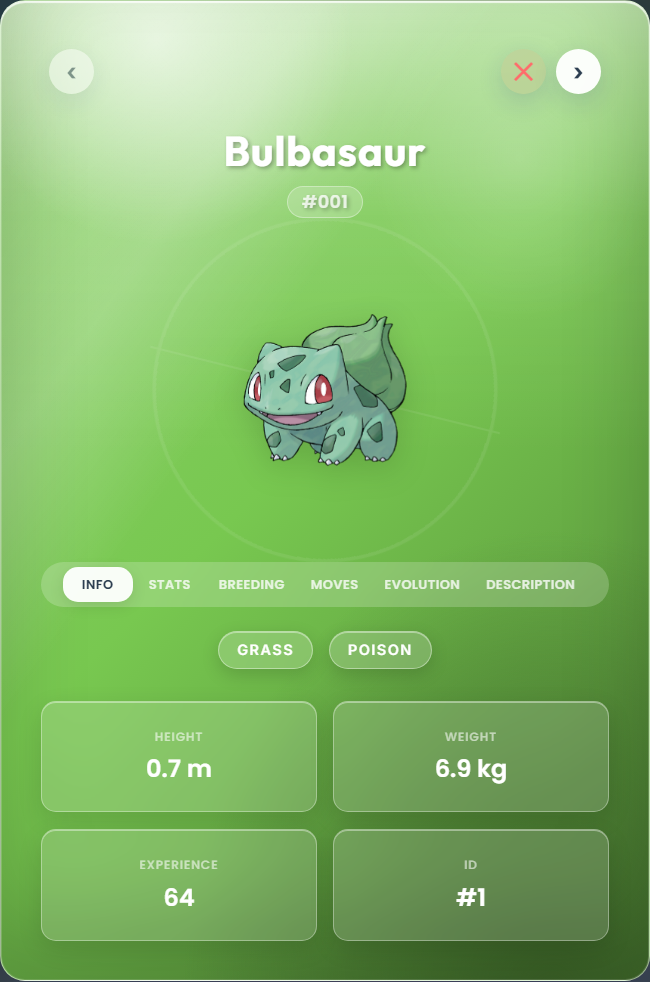
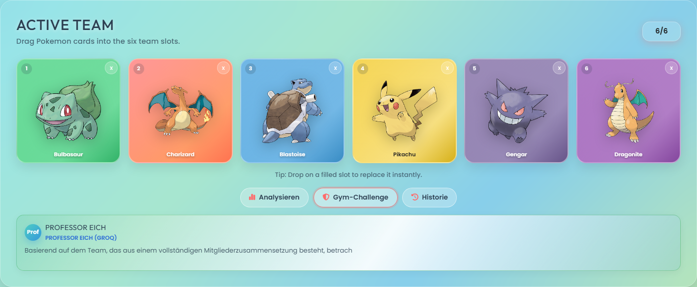
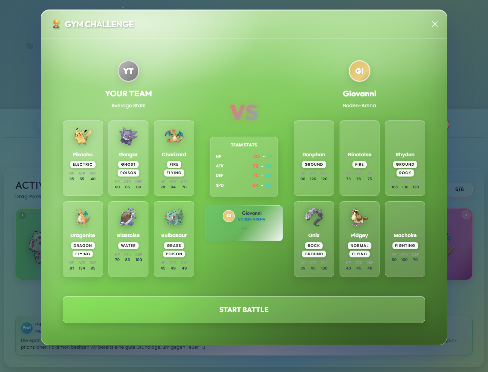
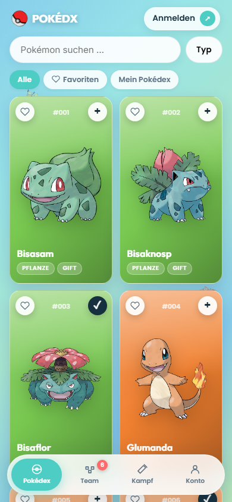

# Pokédex New


Ein moderner Pokédex mit Team-Builder, Team-Analyse, Pokémon-Vergleich, Battle-Simulator, Gym-Challenge und optionaler KI-Unterstützung über einen lokalen Express-Proxy.

---

## Inhaltsverzeichnis

- [Über das Projekt](#über-das-projekt)
- [Highlights](#highlights)
- [Features](#features)
- [Demo-Vorschau](#demo-vorschau)
- [Screenshots](#screenshots)
- [Technologien](#technologien)
- [Installation](#installation)
- [Konfiguration](#konfiguration)
- [Projektstruktur](#projektstruktur)
- [Lokale Speicherung](#lokale-speicherung)
- [API und AI-Proxy](#api-und-ai-proxy)
- [Bekannte Einschränkungen](#bekannte-einschränkungen)
- [Roadmap](#roadmap)
- [Weiterführende Doku](#weiterführende-doku)
- [Lizenz](#lizenz)

---

## Über das Projekt

`Pokedex New` ist eine statische Frontend-App mit lokalem Node-/Express-Server. Das Frontend lädt Pokémon-Daten aus der PokéAPI, rendert Karten und Detailansichten im Browser und speichert benutzerbezogene Daten wie Team, Favoriten, Ratings und Battle-Historie in `localStorage`.

Der lokale Server liefert die App aus und stellt zusätzlich einen AI-Proxy bereit. Dadurch können Groq, Mistral, Gemini und OpenRouter genutzt werden, ohne API-Keys direkt im Frontend-Code zu verankern.

**Projektstatus:** Stand 17.06.2026

## Highlights

| Bereich | Beschreibung |
| --- | --- |
| Pokédex | Suche, Typ-Filter, Pagination, Load-More und Detailansichten |
| Team-Builder | Aktives 6er-Team mit Drag-and-Drop, Slot-Replacement und Offcanvas |
| Team-Analyse | Statische Checks für Coverage, Schwächen und Team-Zusammensetzung |
| KI-Unterstützung | Optionale Teamberatung und Strategiehilfen über lokalen Proxy |
| Battle-System | 1v1-Battle-Simulator, Battle-Log, Export und Gym-Challenge |
| Persistenz | Favoriten, Ratings, Notizen, Presets und Battle-Historie im Browser |

## Features

### Pokédex und Oberfläche

| Feature | Status |
| --- | --- |
| Pokémon-Daten aus der PokéAPI laden | Fertig |
| Suche mit Dropdown-Vorschlägen | Fertig |
| Filter nach Typ, Favoritenstatus und Bewertung | Fertig |
| Karten- und Detailansichten | Fertig |
| Responsive Navigation und mobiles Filter-Menü | Fertig |
| Power-/Strength-Anzeigen und GO-inspirierte Zusatzfunktionen | Fertig |

### Team-System

| Feature | Status |
| --- | --- |
| Team-Offcanvas mit Mini-Cards und Counter | Fertig |
| Active-Team-Builder mit sechs festen Slots | Fertig |
| Drag-and-Drop für Team-Zusammenstellung | Fertig |
| Slot-Replacement bei vollem Team | Fertig |
| Synchronisation zwischen Builder, Offcanvas und `localStorage` | Fertig |
| Statusmeldungen für Team-Änderungen | Fertig |

### Team-Modal und Presets

| Feature | Status |
| --- | --- |
| Aktuelles Team anzeigen | Fertig |
| Einzelne Pokémon entfernen | Fertig |
| Team mischen | Fertig |
| Nicht-Favoriten gesammelt entfernen | Fertig |
| Team als JSON exportieren | Fertig |
| Team über Share API oder Clipboard teilen | Fertig |
| Team-Presets speichern | Teilweise |

### Analyse, KI und Battle

| Feature | Status |
| --- | --- |
| Statische Team-Analyse | Fertig |
| KI-Teamberatung im Team-Builder | Fertig |
| KI-gestützte Analyse mit Provider-Fallback | Fertig |
| Pokémon-Vergleich im Modal | Fertig |
| 1v1-Battle-Simulator mit Rundensystem | Fertig |
| Auto-Play und Battle-Log-Export | Fertig |
| Gym-Challenge gegen generierte Gegnerteams | Fertig |
| Lokale Battle-Statistiken mit Win-Rate, Damage und MVP | Fertig |

## Demo-Vorschau

### Hauptworkflow



### Desktop-Skizze

```text
┌──────────────────────────────────────────────────────────────┐
│                         POKÉDEX NEW                          │
│        Suche, Typ-Filter, Favoriten, Ratings, Power           │
├──────────────────────────────────────────────────────────────┤
│ [Search Pokémon...] [Type] [Favorites] [Rating] [Load More]   │
│                                                              │
│  ┌──────────┐ ┌──────────┐ ┌──────────┐ ┌──────────┐          │
│  │ #001     │ │ #004     │ │ #007     │ │ #025     │          │
│  │ Bulbasaur│ │Charmander│ │ Squirtle │ │ Pikachu  │          │
│  │ + Team   │ │ + Team   │ │ Compare  │ │ Details  │          │
│  └──────────┘ └──────────┘ └──────────┘ └──────────┘          │
├──────────────────────────────────────────────────────────────┤
│ Team-Builder │ Analyse │ Battle-Simulator │ Gym-Challenge     │
└──────────────────────────────────────────────────────────────┘
```

## Screenshots

Die Screenshots werden mit Playwright aus der laufenden App erzeugt:

```powershell
npm run screenshots
```

| Ansicht | Vorschau |
| --- | --- |
| Pokédex Desktop |  |
| Pokémon Detail |  |
| Team-Builder |  |
| Gym-Challenge |  |
| Mobile Ansicht |  |

## Technologien

| Technologie | Verwendung |
| --- | --- |
| HTML5 | Grundstruktur der App |
| CSS3 | Layout, Responsive Design, Karten, Modal- und Battle-UI |
| JavaScript ES6+ | Frontend-Logik, Module, State, DOM-Updates |
| Node.js | Lokale Laufzeit für den Server |
| Express | Statisches Hosting und AI-Proxy |
| PokeAPI | Pokémon-Daten, Typen, Stats und Sprites |
| Groq / Mistral / Gemini / OpenRouter | Optionale KI-Provider für Analyse und Strategie |

## Installation

### Voraussetzungen

- Node.js
- npm
- Optional: API-Key für mindestens einen KI-Provider

### Setup

```bash
npm install
```

```powershell
Copy-Item .env.example .env
```

```bash
npm start
```

Die App läuft danach standardmäßig unter:

```text
http://localhost:3000
```

## Konfiguration

Die Datei `.env.example` enthält die verfügbaren Server-Optionen:

```env
GROQ_API_KEY=your-groq-api-key
GROQ_MODEL=llama-3.1-8b-instant
MISTRAL_API_KEY=your-mistral-api-key
GEMINI_API_KEY=your-gemini-api-key
GEMINI_MODEL=gemini-2.5-flash
OPENROUTER_API_KEY=your-openrouter-api-key
OPENROUTER_MODEL=meta-llama/llama-3.1-8b-instruct
AI_PROVIDER=
PORT=3000
```

Mindestens ein AI-Key ist nur nötig, wenn KI-Funktionen über den lokalen Proxy genutzt werden sollen. Die reine Pokédex- und Team-Funktionalität läuft ohne AI-Key.

## Projektstruktur

| Datei / Bereich | Zweck |
| --- | --- |
| `index.html` | Grundlayout, Filter, Offcanvas, Team-Modal, Team-Builder |
| `main.js` | Bootstrap und Initialisierung der Frontend-Module |
| `server.js` | Express-Server und AI-Proxy |
| `assets/css/*` | Modulare Styles für Pokédex, Karten, Team, Analyse und Battle |
| `assets/icon/*` | SVG-Icons für Pokémon-Typen |
| `assets/img/9.png` | Favicon / Pokéball-Asset |
| `script/pokemon-*` | Pokédex, Karten, Detailansichten und GO-Features |
| `script/team-*` | Team-Builder, Team-Modal, Team-Analyse und Gym-Battle |
| `script/battle-*` | Battle-Simulator und Battle-Historie |
| `script/services/*` | API-, Storage-, State- und Service-Schicht |
| `js/ai-service.js` | Frontend-AI-Client für Kampfkommentare und Dialoge |

## Lokale Speicherung

Die App speichert nutzerbezogene Daten im Browser:

| Key | Inhalt |
| --- | --- |
| `pokemonTeam` | Aktuelles Team |
| `pokemonFavorites` | Favorisierte Pokémon |
| `pokemonRatings` | Lokale Bewertungen |
| `pokemonNotes` | Lokale Notizen |
| `pokemonTeamPresets` | Gespeicherte Team-Presets |
| `pokemonBattleHistory` | Verlauf und Statistiken der Kämpfe |
| lokale AI-Key-Einträge | Optionale Frontend-Nutzung ohne Proxy |

## API und AI-Proxy

### PokéAPI

Die App nutzt die öffentliche PokéAPI:

```text
https://pokeapi.co/api/v2/
```

Typische Endpoints:

```text
GET /pokemon?limit=20&offset=0
GET /pokemon/{id-or-name}
GET /type/{type-name}
```

### Lokaler AI-Proxy

Der Express-Server stellt AI-Funktionen für Team-Analyse, Strategieauswertung und Dialoge bereit. Unterstützte Provider:

- Groq
- Mistral
- Gemini
- OpenRouter

Welchen Anbieter eine Anfrage nimmt, entscheidet das Frontend – nur so kann es bei einem Ausfall der Reihe nach die anderen durchprobieren. Optional legt `AI_PROVIDER` (`groq`, `mistral`, `gemini` oder `openrouter`) fest, welcher Anbieter genommen wird, wenn das Frontend keinen nennt. Bleibt der Wert leer, ist das Groq.

Der Proxy ist optional. Ohne konfigurierte API-Keys fallen die KI-Funktionen weg, während die übrigen App-Funktionen weiter nutzbar bleiben.

## Bekannte Einschränkungen

- Notizen sind im Datenmodell und in Teilen der Logik vorhanden, aber nicht als voll ausgebaute Hauptfunktion sichtbar.
- Team-Presets können gespeichert werden, es gibt aber noch keine vollständige Preset-Verwaltung mit Laden und Löschen.
- Das Projekt enthält ältere und neuere Modulbereiche parallel. `main.js` initialisiert den aktuell genutzten Satz.
- Es gibt aktuell nur ein Start-Script und keine automatisierte Test-Suite im `package.json`.

## Roadmap

| Status | Thema |
| --- | --- |
| Geplant | Preset-Verwaltung mit Laden, Umbenennen und Löschen |
| Geplant | Sichtbare Notizfunktion in Detailansichten |
| Fertig | Automatisierte README-Screenshots mit Playwright |
| Geplant | Automatisierte Tests für Team-State, Storage und Battle-Logik |
| Optional | Deployment-Konzept für statisches Frontend plus AI-Proxy |

## Weiterführende Doku

- [FEATURES.md](./FEATURES.md) - ausführliche Feature-Übersicht
- [.env.example](./.env.example) - Beispielkonfiguration für den lokalen Server

## Lizenz

Das Projekt ist zu Lernzwecken entstanden. Pokémon und zugehörige Marken gehören Nintendo, Game Freak und The Pokémon Company. Die Pokémon-Daten werden über die PokéAPI bezogen.
