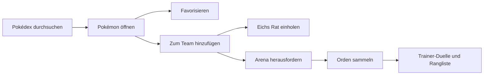
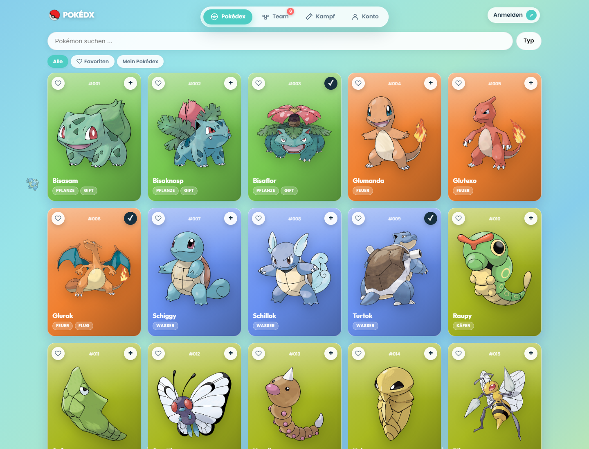
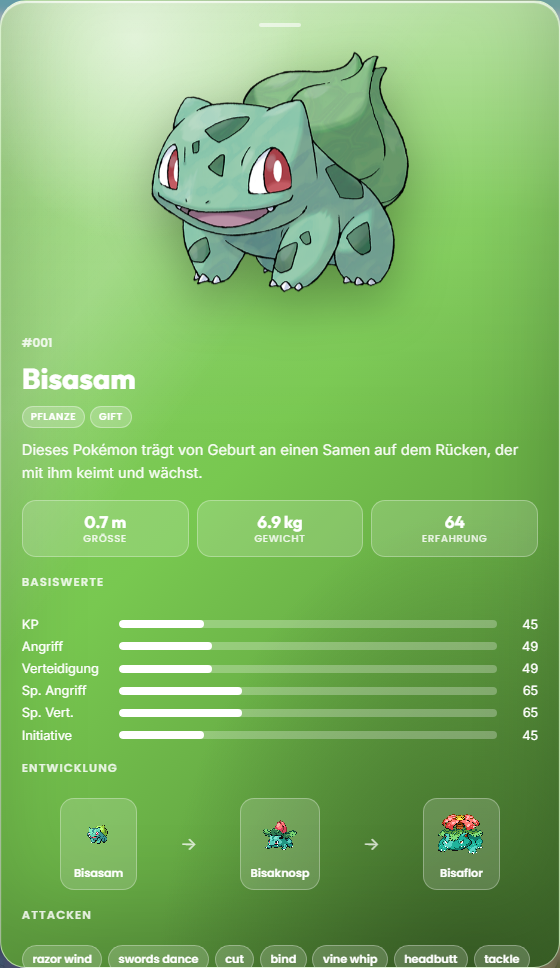
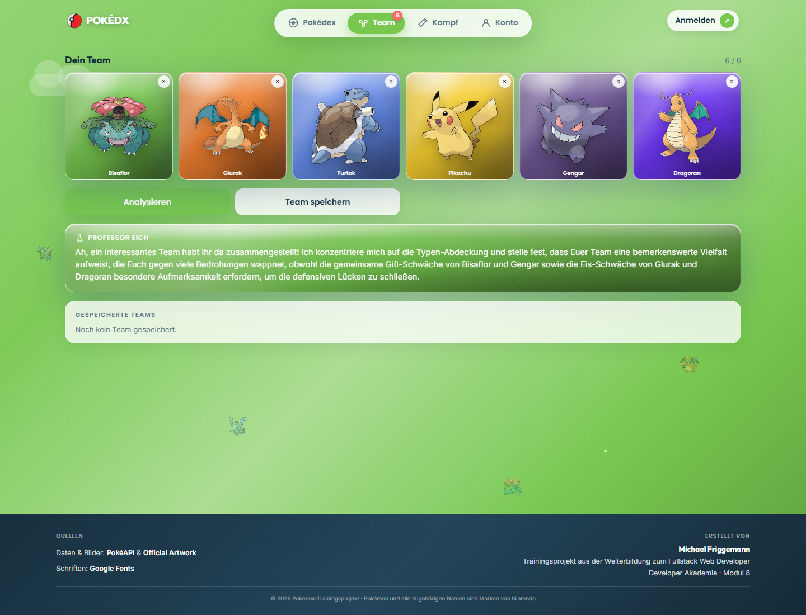
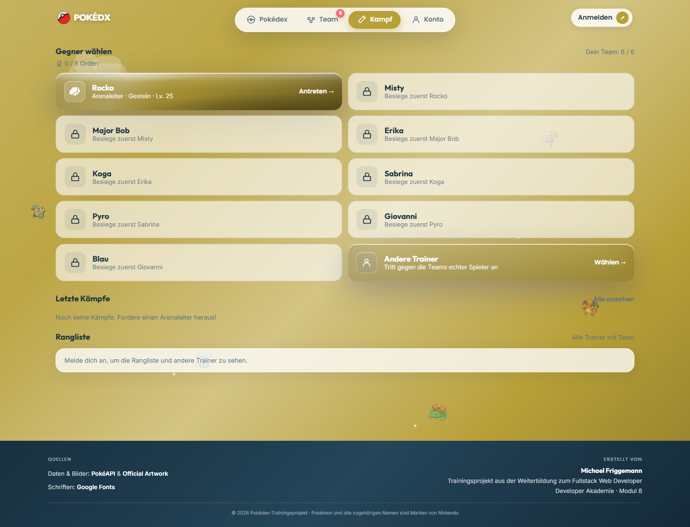

# Pokédex New


Ein moderner Pokédex mit Team-Builder, Liga-Modus mit Orden, Arena-Kämpfen, Trainer-Duellen und optionaler KI-Unterstützung über das Django-Backend.

---

## Inhaltsverzeichnis

- [Über das Projekt](#über-das-projekt)
- [Highlights](#highlights)
- [Features](#features)
- [Demo-Vorschau](#demo-vorschau)
- [Screenshots](#screenshots)
- [Technologien](#technologien)
- [Installation](#installation)
- [Konfiguration](#konfiguration)
- [Projektstruktur](#projektstruktur)
- [Lokale Speicherung](#lokale-speicherung)
- [API und KI](#api-und-ki)
- [Bekannte Einschränkungen](#bekannte-einschränkungen)
- [Roadmap](#roadmap)
- [Weiterführende Doku](#weiterführende-doku)
- [Lizenz](#lizenz)

---

## Über das Projekt

`Pokedex New` besteht aus zwei Teilen: einem statischen Frontend, das ein kleiner Express-Server ausliefert, und einem Django-Backend. Das Backend cached die PokéAPI serverseitig, stellt die KI-Endpunkte bereit und speichert mit Konto Team, Favoriten, Presets, Orden und Kampfhistorie in der Datenbank. Ohne Konto bleiben diese Daten im `localStorage` des Browsers – die App läuft dann genauso, nur ohne Geräte-Sync.

Die KI-Provider (Groq, Mistral, Gemini, OpenRouter) werden ausschließlich vom Backend angesprochen; API-Keys tauchen nie im Frontend auf.

**Projektstatus:** Stand 18.07.2026

## Highlights

| Bereich | Beschreibung |
| --- | --- |
| Pokédex | Suche über den ganzen Pokédex, Typ-Filter, Ansichts-Chips, Detail-Sheet |
| Team | Sechs Slots, Professor-Eich-Rat (optional per KI), gespeicherte Teams |
| Liga | Acht Arenen plus Champ, Orden sammeln, steigende Level |
| Kampf | Arena-Kämpfe mit echter Schadensformel; Auto-Modus oder selbst steuern |
| Trainer | Echte Teams anderer Nutzer als Gegner plus Rangliste |
| Konto | Token-Login; Team, Favoriten, Presets, Orden und Kämpfe in der Datenbank |

## Features

### Pokédex und Oberfläche

| Feature | Status |
| --- | --- |
| Pokémon-Daten über den Backend-Cache laden | Fertig |
| Suche über den ganzen Pokédex (lädt fehlende Treffer nach) | Fertig |
| Typ-Filter mit allen 18 Typen und Kontext-Hintergrund | Fertig |
| Ansichts-Chips: Alle / Favoriten / Mein Pokédex | Fertig |
| Detail-Sheet mit Beschreibung, Stats, Entwicklung und Attacken | Fertig |
| Favoriten direkt auf der Karte | Fertig |
| Nachthimmel-Intro mit Konto-Wahl | Fertig |

### Team

| Feature | Status |
| --- | --- |
| Team mit sechs Slots, direkt aus dem Pokédex befüllt | Fertig |
| Einzelne Pokémon entfernen, Zähler und Team-Färbung | Fertig |
| Professor-Eich-Hinweis, auf Wunsch mit echtem KI-Rat | Fertig |
| Team-Presets speichern, laden und löschen | Fertig |

### Liga und Kampf

| Feature | Status |
| --- | --- |
| Liga mit acht Arenen in fester Reihenfolge plus Champ | Fertig |
| Orden sammeln; ein Sieg schaltet die nächste Arena frei | Fertig |
| Arena-Kampf: Auto-Modus als Standard, Attacken selbst wählbar | Fertig |
| Schadensformel mit STAB, Effektivität, Volltreffern und Statusstufen | Fertig |
| Arenaleiter-Dialoge mit optionaler KI | Fertig |
| Andere Trainer als Gegner plus Rangliste | Fertig |
| Kampfhistorie mit Sieg/Niederlage, Schaden und Zügen | Fertig |

### Konto und Sync

| Feature | Status |
| --- | --- |
| Registrieren, Anmelden und Abmelden (Token-Auth) | Fertig |
| Sync von Team, Favoriten, Presets, Orden und Kämpfen | Fertig |
| Statistik-Kacheln im Konto-Bereich | Fertig |

## Demo-Vorschau

### Hauptworkflow



### Desktop-Skizze

```text
┌──────────────────────────────────────────────────────────────┐
│ POKÉDX       [ Pokédex | Team | Kampf | Konto ]   (Anmelden) │
├──────────────────────────────────────────────────────────────┤
│ [ Pokémon suchen … ]                                   (Typ) │
│ (Alle) (Favoriten) (Mein Pokédex)                            │
│                                                              │
│ ┌─────────┐ ┌─────────┐ ┌─────────┐ ┌─────────┐ ┌─────────┐  │
│ │♥ #001  +│ │♥ #002  +│ │♥ #003  +│ │♥ #004  +│ │♥ #005  +│  │
│ │ Bisasam │ │Bisaknosp│ │Bisaflor │ │Glumanda │ │ Glutexo │  │
│ └─────────┘ └─────────┘ └─────────┘ └─────────┘ └─────────┘  │
└──────────────────────────────────────────────────────────────┘

Am Handy wandern die vier Tabs in eine Leiste am unteren Rand.
```

## Screenshots

Die Screenshots werden mit Playwright aus der laufenden App erzeugt (Backend muss dazu laufen):

```powershell
npm run screenshots
```

| Ansicht | Vorschau |
| --- | --- |
| Pokédex Desktop |  |
| Detail-Sheet |  |
| Team |  |
| Liga |  |
| Mobile Ansicht |  |

## Technologien

| Technologie | Verwendung |
| --- | --- |
| HTML5 | Grundstruktur der App |
| CSS3 | Layout, Responsive Design, Karten, Modal- und Battle-UI |
| JavaScript ES6+ | Frontend-Logik, Module, State, DOM-Updates |
| Node.js | Lokale Laufzeit für den Frontend-Server |
| Express | Statische Auslieferung des Frontends |
| Django + DRF | Backend: PokéAPI-Cache, Token-Auth, Konto-Daten, KI-Proxy |
| PokeAPI | Pokémon-Daten, Typen, Stats und Sprites (über den Backend-Cache) |
| Groq / Mistral / Gemini / OpenRouter | Optionale KI-Provider für Analyse und Strategie |

## Installation

### Voraussetzungen

- Node.js
- npm
- Optional: API-Key für mindestens einen KI-Provider

### Setup

Frontend:

```bash
npm install
```

```powershell
Copy-Item .env.example .env
```

Backend (einmalig):

```powershell
cd backend
python -m venv .venv
.venv\Scripts\activate
pip install -r requirements.txt
python manage.py migrate
```

### Starten

Beide Server laufen getrennt:

```bash
npm start                  # Frontend auf http://localhost:3000
```

```powershell
cd backend
python manage.py runserver # Backend auf http://127.0.0.1:8000
```

## Konfiguration

Die gesamte KI-Konfiguration (Groq, Mistral, Gemini, OpenRouter) gehört dem Django-Backend: `backend/config/settings.py` liest die `.env` aus dem Projektwurzelverzeichnis per `load_dotenv` ein, und nur dort werden die Keys benutzt. Der Express-Server liest aus derselben Datei ausschließlich `PORT`:

```env
GROQ_API_KEY=your-groq-api-key
GROQ_MODEL=llama-3.1-8b-instant
MISTRAL_API_KEY=your-mistral-api-key
GEMINI_API_KEY=your-gemini-api-key
GEMINI_MODEL=gemini-2.5-flash
OPENROUTER_API_KEY=your-openrouter-api-key
OPENROUTER_MODEL=meta-llama/llama-3.1-8b-instruct
AI_PROVIDER=
PORT=3000
```

Mindestens ein AI-Key ist nur nötig, wenn KI-Funktionen genutzt werden sollen. Die reine Pokédex- und Team-Funktionalität läuft ohne AI-Key.

## Projektstruktur

| Datei / Bereich | Zweck |
| --- | --- |
| `index.html` | Grundlayout und feste Ladereihenfolge der Frontend-Skripte |
| `js/app/*` | Frontend-Logik: klassische Skripte mit gemeinsamem globalem Scope |
| `server.js` | Express-Server für die statische Auslieferung |
| `assets/css/design/*` | Styles des abgenommenen Designs (Shell, Dex, Team, Sheet, Kampf, Intro, Footer) |
| `assets/icon/*` | SVG-Icons für Pokémon-Typen |
| `assets/img/9.png` | Favicon / Pokéball-Asset |
| `backend/` | Django-Backend: PokéAPI-Cache, Auth, Konto-Daten, KI-Endpoints |
| `test/*` | Frontend-Unit-Tests (`node --test`) |
| `tools/capture-screenshots.js` | Playwright-Skript für die README-Screenshots |

## Lokale Speicherung

Die App speichert nutzerbezogene Daten im Browser:

| Key | Inhalt |
| --- | --- |
| `pokemonTeam` | Aktuelles Team |
| `pokemonFavorites` | Favorisierte Pokémon |
| `pokemonTeamPresets` | Gespeicherte Team-Presets |
| `pokemonBattleHistory` | Verlauf und Statistiken der Kämpfe |
| `pokemonBadges` | Gewonnene Arena-Orden |
| `pokedexToken` | Login-Token für das Backend (nur mit Konto) |
| `pokedexIntroGesehen` | Merker, dass das Intro schon gezeigt wurde |

Mit Konto werden Team, Favoriten, Presets, Orden und Kämpfe zusätzlich auf dem Server gespeichert (`js/app/sync.js`) und beim Login auf andere Geräte übernommen.

## API und KI

### PokéAPI (über den Backend-Cache)

Das Frontend fragt die PokéAPI nicht direkt an, sondern geht über das Django-Backend, das die Antworten serverseitig cached:

```text
GET http://127.0.0.1:8000/api/pokemon/?offset=0&limit=20
GET http://127.0.0.1:8000/api/pokemon/by-type/{type}/
GET http://127.0.0.1:8000/api/pokeapi/pokemon/{id}
```

Das spart wiederholte Browser-Requests an `https://pokeapi.co` und liefert Listen samt Details in einer Antwort.

### KI (im Django-Backend)

Die KI-Funktionen – Team-Analyse, Strategieauswertung, Kampfkommentare und Dialoge – laufen komplett im Backend. Für jede gibt es einen eigenen Endpoint (`/api/ai/team-advice`, `/api/ai/battle-commentary`, `/api/ai/gym-dialogue`, `/api/ai/team-analysis`, `/api/ai/gym-strategy`). Das Frontend schickt nur Rohdaten wie das Team; den Prompt baut Django (`backend/api/prompts.py`).

Unterstützte Provider:

- Groq
- Mistral
- Gemini
- OpenRouter

Das Backend fragt der Reihe nach jeden Anbieter, für den ein Key hinterlegt ist – `AI_PROVIDER` (`groq`, `mistral`, `gemini` oder `openrouter`) zuerst, sonst Groq. Antwortet einer nicht, übernimmt der nächste.

Die KI ist optional. Ohne konfigurierte API-Keys fallen die KI-Funktionen weg, während die übrigen App-Funktionen weiter nutzbar bleiben. Details: [backend/README.md](backend/README.md).

## Bekannte Einschränkungen

- Notizen sind im Backend-Datenmodell vorhanden, im Frontend aber noch nicht sichtbar.
- Team-Presets haben eine vollständige Verwaltung: Unter dem Team-Builder lassen sie sich speichern, laden und löschen. Mit Konto liegen sie auf dem Server.
- Die Frontend-Tests decken bisher nur die Kampf-Logik ab; das Backend hat eine eigene Test-Suite (`python manage.py test api`).
- Das Backend läuft lokal mit SQLite und Entwickler-Settings; env-basierte Settings und Deployment-Härtung sind als M4 (DevSecOps) geplant.

## Roadmap

| Status | Thema |
| --- | --- |
| Fertig | Preset-Verwaltung mit Speichern, Laden und Löschen |
| Geplant | Sichtbare Notizfunktion in Detailansichten |
| Fertig | Neue README-Screenshots vom umgebauten Design |
| Teilweise | Automatisierte Frontend-Tests (Kampf-Logik fertig, Team/Storage offen) |
| Geplant | M4 DevSecOps: env-basierte Settings, Deployment-Konzept, CI |

## Weiterführende Doku

- [FEATURES.md](./FEATURES.md) - ausführliche Feature-Übersicht
- [.env.example](./.env.example) - Beispielkonfiguration (KI-Keys für das Backend, Port des Frontend-Servers)

## Lizenz

Das Projekt ist zu Lernzwecken entstanden. Pokémon und zugehörige Marken gehören Nintendo, Game Freak und The Pokémon Company. Die Pokémon-Daten werden über die PokéAPI bezogen.
